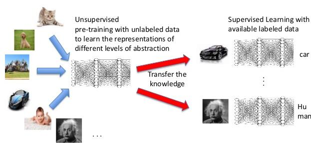
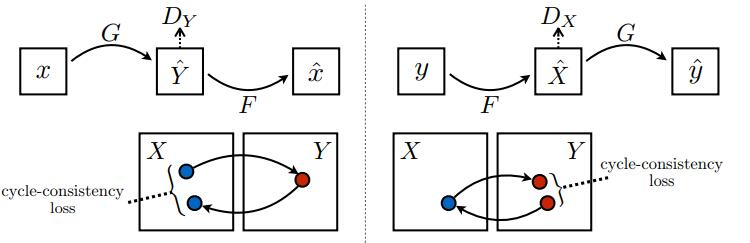

+++
# Project title.
title = "Generative Model"
weight = 1
math = true

# Date this page was created.
date = 2019-08-01T00:00:00

# Project summary to display on homepage.
summary = """Use generative model to generative significant image or equivariance representation"""

# Tags: can be used for filtering projects.
# Example: `tags = ["machine-learning", "deep-learning"]`
tags = ["Generative Model"]

# Optional external URL for project (replaces project detail page).
external_link = ""

# Slides (optional).
#   Associate this project with Markdown slides.
#   Simply enter your slide deck's filename without extension.
#   E.g. `slides = "example-slides"` references
#   `content/slides/example-slides.md`.
#   Otherwise, set `slides = ""`.
slides = ""

# Links (optional).
url_pdf = ""
url_slides = ""
url_video = ""
url_code = ""

# Custom links (optional).
#   Uncomment line below to enable. For multiple links, use the form `[{...}, {...}, {...}]`.
# links = [{icon_pack = "fab", icon="twitter", name="Follow", url = "https://twitter.com"}]

# Featured image
# To use, add an image named `featured.jpg/png` to your project's folder.
[image]
  # Caption (optional)
  caption = ""

  # Focal point (optional)
  # Options: Smart, Center, TopLeft, Top, TopRight, Left, Right, BottomLeft, Bottom, BottomRight
  focal_point = ""

  # Show image only in page previews?
  preview_only = true
+++

# Generative Model for representation

Supervised Deep Learning attracts much attention in several areas but it depends on a huge
amount of labeled data. It is crucial to use existing data and limited label to produce good
representation by maximizing the mutual information, which indicates the mutual dependency between the representation and data. Specifically, it can be regarded as the amount
of information contained in the representation of data. The maximized mutual information
between representation and data means representation covers all information in data and
represent in a different form. Generative Model used in Semi-supervised learning and unsupervised learning settings which only need a small number of labeled data and no labeled data respectively are drawing more and more attention by the deep learning community. 

# Generative Model for image generation

From early auto-encoder model, people try to recontruct image through neural network, and variantional auto-encoder(VAE) is applied to solve the discontinuity in latent space. Geneative Adversarial Network(GAN) attracts people's attention due to the generated realistic image. I am working on applying GAN on other image to image translation problems. Besides, I also try to refine flow-based generative model.
