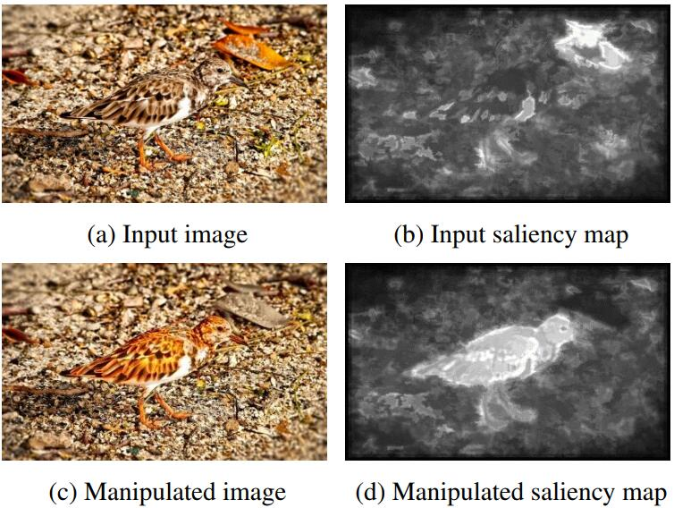

+++
# Project title.
title = "Saliency Retarget"
weight = 1
math = true

# Date this page was created.
date = 2017-07-20T00:00:00

# Project summary to display on homepage.
summary = """Manipulate image visually according to guided saliency(mask)"""

# Tags: can be used for filtering projects.
# Example: `tags = ["machine-learning", "deep-learning"]`
tags = ["Saliency Retarget"]

# Optional external URL for project (replaces project detail page).
external_link = ""

# Slides (optional).
#   Associate this project with Markdown slides.
#   Simply enter your slide deck's filename without extension.
#   E.g. `slides = "example-slides"` references
#   `content/slides/example-slides.md`.
#   Otherwise, set `slides = ""`.
slides = ""

# Links (optional).
url_pdf = ""
url_slides = ""
url_video = ""
url_code = ""

# Custom links (optional).
#   Uncomment line below to enable. For multiple links, use the form `[{...}, {...}, {...}]`.
# links = [{icon_pack = "fab", icon="twitter", name="Follow", url = "https://twitter.com"}]

# Featured image
# To use, add an image named `featured.jpg/png` to your project's folder.
[image]
  # Caption (optional)
  caption = ""

  # Focal point (optional)
  # Options: Smart, Center, TopLeft, Top, TopRight, Left, Right, BottomLeft, Bottom, BottomRight
  focal_point = ""

  # Show image only in page previews?
  preview_only = true
+++

Users often find that the background of images or something we are not interested in are over-salient. Manipulating image according to saliency allows users to generate images with target and controllable saliency. For example, there are two persons in an image and the saliency is focusing on people A. We want to modify the image which makes the saliency switch to person B visually instead of just defrauding saliency in the detection model. Most of the previous methods [1, 2] are based on traditional algorithms like blurring background. As a state-of-the-art framework, [3] proposed the substitution method in which the target image patch with low saliency will be replaced by the image patch with high saliency and similar content retrieved from the dataset. Although saliency of the target patch can be modified, the whole image would be distorted.  As a result, how to use GAN to keep the images authentic and manipulate images to achieve our target saliency is still an open problem.

[1]  T.  V.  Nguyen,  B.  Ni,  H.  Liu,  W.  Xia,  J.  Luo,  M.  Kankanhalli,  and S.  Yan,  “Image re-attentionizing,” IEEE Transactions on Multimedia ,  vol.  15,  no.  8,  pp. 1910–1919, 2013.

[2]  V.  A.  Mateescu  and  I.  V.  Bajic,  “Visual  attention  retargeting,”
IEEE Multimedia, vol. 23, no. 1, pp. 82–91, 2016.

[3]  R. Mechrez, E. Shechtman, and L. Zelnikmanor, “Saliency driven image manipulation,” in IEEE Winter Conference on Applications of Computer Vision, 2018